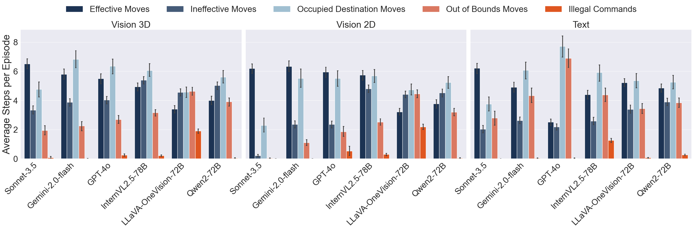

<div id="readme-top"></div>


<br>


<br>


<br>


# :jigsaw: iVISPAR
Vision-Language Models (VLMs) are known to face challenges with spatial reasoning and visual alignment. iVISPAR (Interactive Visual-Spatial Reasoning benchmark) addresses these limitations by providing an interactive environment designed to evaluate the capabilities of VLMs as agents in this context.

The benchmark focuses on a specific scenario — a variation of the generalized Sliding Tile Puzzle, a classic problem that requires logical planning, spatial awareness, and multi-step problem-solving. iVISPAR features a fully customizable Sliding Tile Puzzle simulator that uses 3D geometric shapes (geoms) and a natural language API, enabling VLMs to interact directly with the scene by prompting actions.

The benchmark supports evaluation through both visual modality and text-based representations of geoms and their coordinates. This dual approach allows for a comprehensive assessment of visual-spatial scene understanding and spatial planning capabilities. To gauge model performance, agents are compared against a human baseline, random agents, and the A* algorithm, providing insight into the problem's complexity ceiling and the alignment of the model's spatial reasoning with human logic.

<div align="center">
  
  <p><em>Figure 1: Visualization of GPT-4's interaction with the Sliding Geom Puzzle (SGP).</em></p>
</div>

## Table of Contents
1. [Features](#joystick-features)
2. [Environments](#video_game-puzzle-environments)
3. [Results](#test_tube-results)
4. [Leaderboard](#trophy-leaderboard)
5. [Overview](#mount_fuji-overview)
6. [Setup](#package-setup)
7. [Quick Start](#rocket-quick-start)
8. [Citation](#bookmark-citation)
9. [Contact](#mailbox_with_mail-contact)

## :joystick: Features
### Benchmarking
- **Multi-modal evaluation:** Assess visual-spatial reasoning in VLMs using both visual and text-based representations.
- **VLM agent integration:** Includes an VLM API to seamlessly integrate models as agents for interactive puzzle-solving tasks.
- **AI agent integration:** Provides benchmark comparisons with solutions from A* agents and random agents to establish performance baselines.
- **Customizable and automated:** Offers high customizability with automated tools for testing, evaluation, and comparative analysis.

<div align="center">
  
  <p><em>Visualizations of VLMs’ observations for the active and goal states for all modalities: vision 3D (left), vision 2D (middle),
text-base representation, provided to models as a string (right) on a 4x4 board at each step during the Sliding Geom Puzzle environment.</em></p>
</div>

### Simulation
- **Featuring two puzzle scenarios:** Includes two distinct puzzle scenarios, Sliding Geom Puzzle (SGP) and Sliding Tile Puzzle (STP), with a prompt-based API, allowing VLM agents to interact with the environment through an action-perception loop.
- **Ready-to-use:** Fully operational right out of the box — no additional installation or dependency requirements.
- **Interactive web app:** A browser-based graphical user interface (GUI) for human participants to interact with the puzzles, enabling human baseline comparisons.
- **Flexible deployment:** Run the simulation locally or host it on a server for online access and remote experimentation.
- **Future addition:** Incorporation of additional spatial reasoning puzzles to enable more comprehensive evaluation of visual-spatial reasoning capabilities.
   
### Datasets
- **Custom puzzle generation:** Generate interactive Sliding Tile Puzzle or Sliding Geom Puzzle datasets tailored to specific experimental needs.
- **Move sequence visualization:** Each puzzle configuration includes an animated minimal move sequence (computed using A*) to illustrate puzzle complexity.
- **Pre-generated datasets:** Access a library of pre-generated test datasets for quick experimentation and evaluation.
- **Future addition:** Incorporation of human performance data to define the problem's complexity ceiling and analyze the alignment of model-based spatial reasoning with human logic.


<div align="center">
  
  <p><em>Depiction of the interaction flow between VLM agents and the iVISPAR Simulator with a progression through an episode with
the shortest path solution of 4 steps being solved by prompted actions from a VLM agent.
</em></p>
</div>


<p align="right">(<a href="#readme-top">back to top</a>)</p>

## :video_game: Puzzle Environments

### Sliding Geom Puzzle (SGP)
This is a 3D implementation of the generalized sliding tile puzzle (GSTP), where agents are tasked with moving geoms from a randomly sampled initial to a randomly sampled goal state. Agents can move tiles in the four cardinal directions (following the von Neumann neighborhood) using text prompts that reference their color and shape. Configuration options include board size, number of geoms, shapes and colors of geoms, camera angles, visibility of board labels, representation types (vision or text), complexity (minimal move sequence length), and more. 
```bash
# Example action:
move blue sphere right
```

<div align="center">
  
  <p><em>Figure 2: Visualization of Sliding Geom Puzzle (SGP) configuration examples of varying sizes solved by A*.</em></p>
</div>


### Sliding Tile Puzzle (STP)
This is a 3D implementation of the classic Sliding Tile Puzzle (STP), commonly known as the 15-Puzzle or n-Puzzle. Agents are tasked with moving tiles from a randomly sampled initial configuration to a goal state where the numbered tiles are arranged in order. Agents can move tiles in the four cardinal directions (following the von Neumann neighborhood) using text prompts that reference the tile number. STP is a well-known NP-hard problem. Configuration options include board size, number of tiles, camera angles, visibility of board labels, representation types (vision or text), complexity (minimal move sequence length), and more.
```bash
# Example action:
move tile 5 down
```

<div align="center">
  
  <p><em>Figure 3: Visualization of Sliding Tile Puzzle (STP) configuration examples of varying sizes solved by A*.</em></p>
</div>

<p align="right">(<a href="#readme-top">back to top</a>)</p>

## :trophy: Leaderboard

<table>
  <thead>
    <tr>
      <th rowspan="2">Model</th>
      <th colspan="4">Completed Episodes</th>
      <th colspan="4">Step-Deviation from Optimal Path</th>
    </tr>
    <tr>
      <th>All</th>
      <th>3D</th>
      <th>2D</th>
      <th>Text</th>
      <th>All</th>
      <th>3D</th>
      <th>2D</th>
      <th>Text</th>
    </tr>
  </thead>
  <tbody>
    <tr>
      <td>Sonnet-3.5 <sup>[1]</sup></td>
      <td>54.56</td><td>28.67</td><td>89.67</td><td>45.33</td>
      <td>3.05</td><td>4.10</td><td>1.44</td><td>3.60</td>
    </tr>
    <tr>
      <td>Gemini-2.0-flash <sup>[2]</sup></td>
      <td>27.11</td><td>12.67</td><td>47.33</td><td>21.33</td>
      <td>4.87</td><td>5.25</td><td>4.09</td><td>5.26</td>
    </tr>
    <tr>
      <td>GPT-4o <sup>[3]</sup></td>
      <td>17.56</td><td>9.33</td><td>37.33</td><td>6.00</td>
      <td>5.30</td><td>5.45</td><td>4.15</td><td>6.30</td>
    </tr>
    <tr>
      <td>InternVL2.5-78B <sup>[4]</sup></td>
      <td>10.16</td><td>1.67</td><td>9.42</td><td>19.33</td>
      <td>5.98</td><td>6.39</td><td>5.86</td><td>5.69</td>
    </tr>
    <tr>
      <td>LLaVA-OneVision-72B <sup>[5]</sup></td>
      <td>8.22</td><td>0.67</td><td>1.33</td><td>22.67</td>
      <td>6.35</td><td>6.75</td><td>6.81</td><td>5.50</td>
    </tr>
    <tr>
      <td>Qwen2-72B <sup>[6]</sup></td>
      <td>5.89</td><td>0.67</td><td>1.67</td><td>15.33</td>
      <td>6.37</td><td>6.66</td><td>6.54</td><td>5.90</td>
    </tr>
  </tbody>
</table>

[^1]: Sonnet-3.5 [Claude Sonnet-3.5](https://yourcitationlink.com)
[^2]: Gemini-2.0-flash [Gemini 2.0 Flash](https://yourcitationlink.com)
[^3]: GPT-4o [GPT-4o](https://yourcitationlink.com)
[^4]: InternVL2.5-78B [Chen et al., 2024](https://yourcitationlink.com)
[^5]: LLaVA-OneVision-72B [Li et al., 2024](https://yourcitationlink.com)
[^6]: Qwen2-72B [Qwen2 VL](https://yourcitationlink.com)

<div align="center">
  
</div>
  <p><em>VLMs' success rates of completed games over 900 episodes across all modalities: vision 3D, vision 2D, and text.</em></p>

<p align="right">(<a href="#readme-top">back to top</a>)</p>

## :test_tube: Results
Results on the SGP problem are shown below. For more details. More details about the results can be found  [here](Resources/HowTo/result_details.md).

<div align="center">
  
  <p><em>VLM evaluation on 900 episodes per model across all three modalities, with 95% confidence intervals. Baseline comparisons for human performance and random moves are shown. VLMs’ success rates of episodes completed with higher values denoting
better performance</em></p>
</div>


<div align="center">
  
  <p><em>VLMs’ average action counts per episode. Effective / ineffective actions respectively decrease / increase the path length to the
goal state. Occupied destination and out-of-bounds are invalid moves, while illegal commands break the instructed action format, all of
which leave the board state unchanged. </em></p>
</div>


<div align="center">
  
  <p><em> Cumulative heatmaps of VLMs’ minimal paths to the goal state after 20 steps across varying complexities, with the number of
geoms and shortest path solutions ranging from 2 to 11. Evaluated over 5400 episodes across all modalities (vision 3D, vision 2D, text).</em></p>
</div>


<p align="right">(<a href="#readme-top">back to top</a>)</p>


## :mount_fuji: Overview

The repository is organized into four main directories:

### **(1) Source**: 
Contains all the source code required to generate datasets, run experiments, and evaluate results.
    
1. **[Configuration](/Source/Configure):** Scripts for generating puzzle configuration datasets.
2. **[Experiment](/Source/Experiment):** Code for running experiments based on the generated configurations.
3. **[Evaluation](/Source/Evaluate):** Tools for analyzing and evaluating experimental results.
4. **[Utility](/Source/Utility):** Independent utility scripts that add functions for the project.
5. **[iVISPAR](/Source/iVISPAR):** The Unity project files for the iVISPAR web application.
    
### **(2) Data**:
Contains all data used or generated by the source code, including
 1. **[Configs](/Data/Configs/):** Contains puzzle configuration files used as input for experiments.
 2. **[Experiments](/Data/Experiments/):** Raw data generated while running experiments, such as logs and execution traces.
 3. **[Instructions](Data/Instructions/):** Instructions or prompts used to guide AI agents or human participants.
 4. **[API keys](/Data/API-keys/):** Contains the file to set your API keys (note: ensure this directory is properly secured and excluded from any public commits).
 5. **[Params](/Data/Params/):** Parameter files used to configure and customize experiments and agent behavior.
 6. **[Results](/Data/Results/):** Final output of the experiments, including performance metrics, logs, and summaries.

### **(3) iVISPAR**: 
This directory contains the compiled version of the iVISPAR web app, ready to be launched in your browser. It requires no additional compilation or modification. However, it must connect to the experiment via Python to receive configuration files.

### **(4) Resources**: 
Contains metadata files and supporting resources for the project. This may include environment files, dependency lists, and documentation files.

<p align="right">(<a href="#readme-top">back to top</a>)</p>

## :package: Setup

iVISPAR has minimal dependencies and can be easily set up and run in just a few simple steps.

### Clone

Clone the repository.

```bash
git clone https://github.com/SharkyBamboozle/iVISPAR.git
cd iVISPAR
```

### Conda

iVISPAR runs on Python 3. You can find the list of required Python dependencies in [Resources/environment.yml](Resources/environment.yml). We recommend using [Anaconda](https://www.anaconda.com/) to create a new conda environment.

```bash
conda env create -f Resources/environment.yml
conda activate conda_env_iVISPAR
```

### Python

You can find an example of how to run the code in [Source/main.py](Source/main.py). First, the script generates a minimal dataset of configuration files. Next, iVISPAR is launched in your web browser and prompts you to copy the client ID from the web app into the Python console. Once connected, an AI agent, acting as a stand-in for your VLMs API connection, executes the optimal path. Finally, the results are evaluated and plotted automatically. For more details, see [Quick Start](#rocket-quick-start).

```bash
cd Source
python main.py
```

### Unity

The project includes the compiled [iVISPAR](iVISPAR) web app, which works out of the box on any common operating system with a web browser installed. The web app is built with C# using Unity, and its source code is available in [Source/iVISPAR](Source/iVISPAR). No knowledge of C# or compilation of the Unity project is required to run experiments with iVISPAR. We also provide a fully online working version for human experiments.


<div align="center">
  
  <p><em>Figure 7: Web app with UI for human experiments.</em></p>
</div>

<p align="right">(<a href="#readme-top">back to top</a>)</p>

## :rocket: Quick Start

 We have prepared a [Getting Started Guide](Resources/HowTo/how_to_run_experiments.md) with step-by-step instructions to help you get started quickly.


<p align="right">(<a href="#readme-top">back to top</a>)</p>